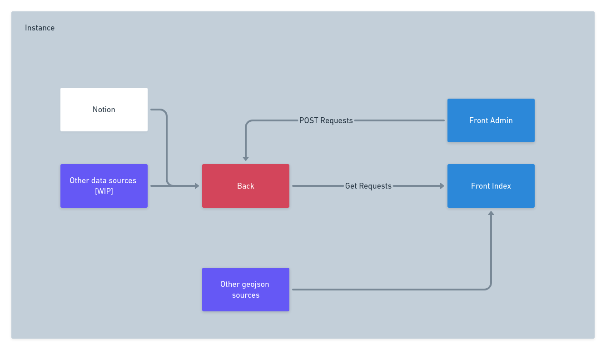

# 🌍 DatAtlas
DatAtlas allows you to create a map of the territory on the fly by embedding data from different sources: open sourced data but also crowdsourced data

All infos about the front and the back are stored here

React Front  using [kepler.gl]()

# Front Setup =

[more infos here WIP](docs/front.md)

##  Using docker
The easiest way to launch datAtlas can be by using docker-compose

1. Clone the repo 
> https://github.com/datatlas-erasme/front.git

1. Copy **env.example** and rename it into **.env**
2. Put your mapbox token in the **.env** file
3. Launch DatAtlas
> docker-compose up

Now you can access the server trough http://localhost:5007

## Manually

**Requirements**
- [nodejs](https://nodejs.org/en/)
- [a mapbox api access token](https://docs.mapbox.com/help/glossary/access-token/)

1. Clone the repo 
> https://github.com/datatlas-erasme/front.git

2. Copy env.example and rename it into .env
3. Put your mapbox token in the .env file

[WIP TODO]
- Change the backend var URl

4. Install and start npm
> npm install
> npm start

# Back Setup

[more infos here WIP](docs/back.md)

## How does datatlas work [WIP]

Datatlas is made of a front and a back

The **front** is a keplergl surcharged with a styling and theme management [WIP]

The **back** is here to give the **front** the styling,dataset configuration and urls
He is also able to handle notion tables he converts into a readable keplergl json format (and soon other unconventionnal data sources / unconventionnal => no geojson )

The front needs the back server to know :
- wich data layers he needs to load
- wich name he has (ex: Datatlas-Industries)
- wich optionnal button he has (ex: crowdsourcing buttons to add a new point on the map) 
- how are the layers and filters configured by default

two API routes are used for it : 

GET api/

more infos on routes [here](docs/back.md)

## Production
DatAtlas is not ready for production yet

